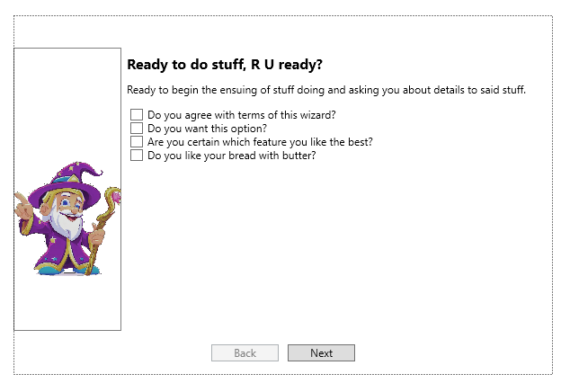

Sure, here are the `README.md` files for your `WizardControl` and `WizardPage`:

## WizardControl

```markdown
# WizardControl

The `WizardControl` is a custom WPF control that presents a series of `WizardPage`s to assist the user in performing a task or series of tasks.



## Features

- Supports dynamic addition and removal of `WizardPage`s.
- Navigation between pages with Back and Next buttons.
- Finish button on the last page.
- Event fired when the wizard is finished.
- Page indication with a title for each page and a fraction representing the current page number out of the total number of pages.

## Usage

Here's an example of how to use the `WizardControl` in XAML:

```xaml
<custom:WizardControl>
    <custom:WizardPage Title="Page 1" Description="This is the first page.">
        <!-- Page 1 content goes here -->
    </custom:WizardPage>
    <custom:WizardPage Title="Page 2" Description="This is the second page.">
        <!-- Page 2 content goes here -->
    </custom:WizardPage>
    <!-- Add more pages as needed -->
</custom:WizardControl>
```

In this example, `custom` is the XML namespace prefix that corresponds to the CLR namespace and assembly where `WizardControl` is defined.

## Customization

You can customize the appearance of the `WizardControl` by modifying its control template in a `Style`. See the [WPF styling and templating](https://docs.microsoft.com/en-us/dotnet/desktop/wpf/fundamentals/styling-templating?view=netframeworkdesktop-4.8) documentation for more information.
```

## WizardPage

```markdown
# WizardPage

The `WizardPage` is a custom WPF control that represents a single page within a `WizardControl`.


## Features

- Supports arbitrary content.
- Has a `Title` and `Description` that can be displayed by the `WizardControl`.

## Usage

Here's an example of how to use the `WizardPage` in XAML:

```xaml
<custom:WizardPage Title="Page 1" Description="This is the first page.">
    <!-- Page content goes here -->
</custom:WizardPage>
```

In this example, `custom` is the XML namespace prefix that corresponds to the CLR namespace and assembly where `WizardPage` is defined.

## Customization

You can customize the appearance of the `WizardPage` by modifying its control template in a `Style`. See the [WPF styling and templating](https://docs.microsoft.com/en-us/dotnet/desktop/wpf/fundamentals/styling-templating?view=netframeworkdesktop-4.8) documentation for more information.
```

Please replace `custom` with the appropriate XML namespace prefix for your project, and replace the image paths with the actual paths to your images.